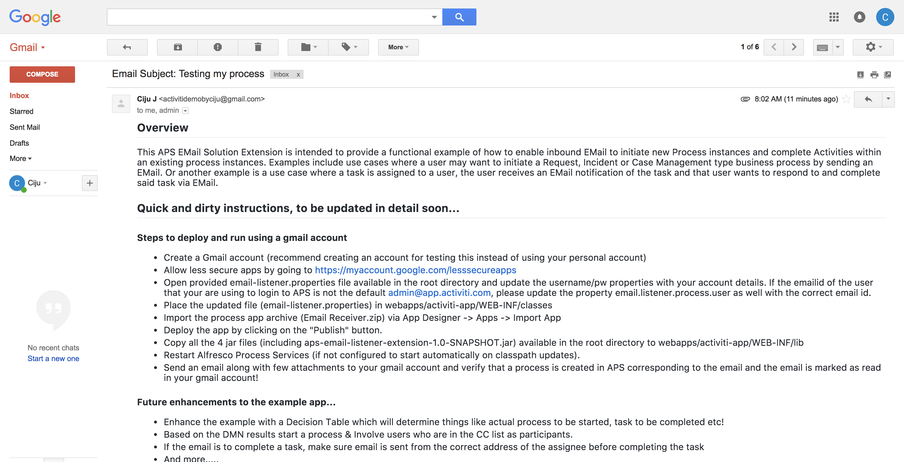
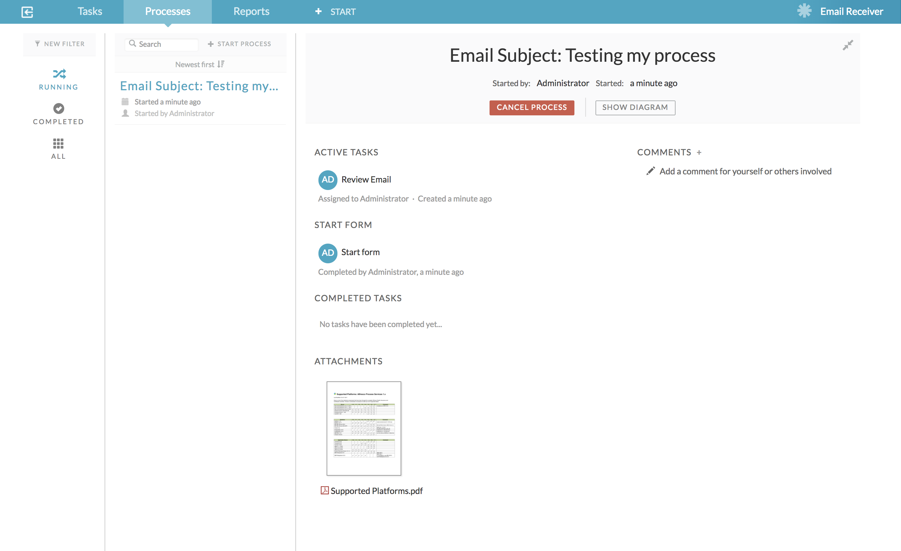
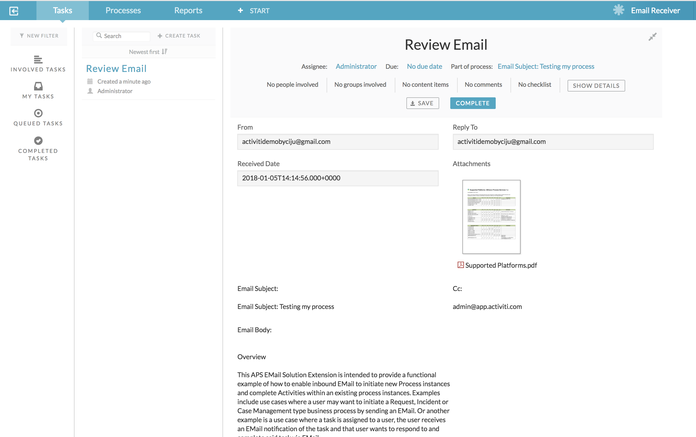

## Overview
This APS EMail Solution Extension is intended to provide a functional example of how to enable inbound EMail to initiate new Process instances and complete Activities within an existing process instances.  Examples include use cases where a user may want to initiate a Request, Incident or Case Management type business process by sending an EMail.  Or another example is a use case where a task is assigned to a user, the user receives an EMail notification of the task and that user wants to respond to and complete said task via EMail. 

## Quick and dirty instructions, to be updated in detail soon...

### Steps to deploy and run using a gmail account

* Create a Gmail account (recommend creating an account for testing this instead of using your personal account)
* Allow less secure apps by going to https://myaccount.google.com/lesssecureapps
* Open provided email-listener.properties file available in the root directory and update the username/pw properties with your account details. If the emailid of the user that your are using to login to APS is not the default admin@app.activiti.com, please update the property email.listener.process.user as well with the correct email id.
* Place the updated file (email-listener.properties) in webapps/activiti-app/WEB-INF/classes
* Import the process app archive (Email Receiver.zip) via App Designer -> Apps -> Import App
* Deploy the app by clicking on the "Publish" button.
* Copy all the 4 jar files (including aps-email-listener-extension-1.0-SNAPSHOT.jar) available in the root directory to webapps/activiti-app/WEB-INF/lib
* Restart Alfresco Process Services (if not configured to start automatically on classpath updates).
* Send an email along with few attachments to your gmail account and verify that a process is created in APS corresponding to the email and the email is marked as read in your gmail account!

#### Future enhancements to the example app...
* Enhance the example with a Decision Table which will determine things like actual process to be started, task to be completed etc!
* Based on the DMN results start a process & Involve users who are in the CC list as participants. 
* If the email is to complete a task, make sure email is sent from the correct address of the assignee before completing the task
* And more.....

## Some screenshots from running the example

##### Email

##### Process Instance

##### Task Instance showing email fields including attachments

