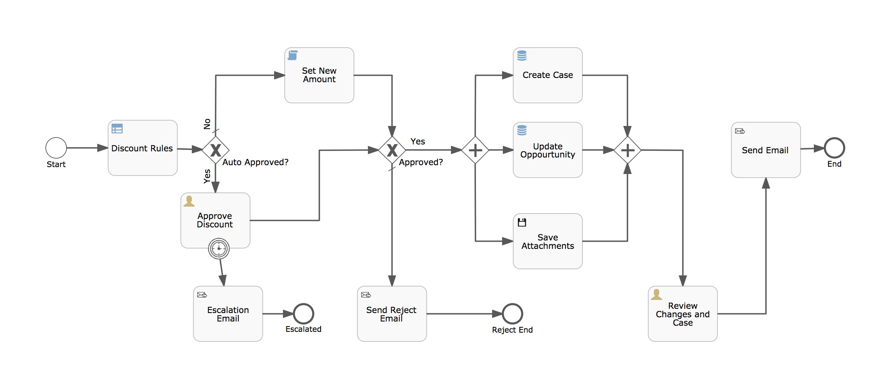

## Process Diagram & Overview
A demo showing some of the powerful enterprise only features for APS such as Stencils, Data Models etc which can accelerate process design and development using a model driven approach!


#### Opportunity Discount Approval Use Case
The business process in this demo is to request a discount for an Opportunity in Salesforce. As you  can see from above diagram, when the process is started some discount rules are executed. Based on the rule, the process will either take either a manual or automated approval path. In case of an auto-approval the system will calculate the new amount based on the discount requested. In case of a manual path, the approver will need to manually approve the request. There is also a boundary timer event on the user task to send a reminder email if the task is not actioned within a certain timeframe. As you can see, the escalation email component is a custom component created using the stencil feature of APS. The user task form is configured with a lot of Salesforce data which is fetched from Salesforce (this shows the realtime Read function of data models in APS) which will enable the approver to make better decisions without logging into Salesforce UI! If the approver rejects the request, an email will be send to the requester and process ends there. On approval, the process flows further and reaches a parallel gateway where three things are configured to happen in parallel. 1) Create a case in Salesforce - this shows the Create function of data model. 2) Update the opportunity in Salesforce - this shows the Update function of data model. 3) Save attachments to a location configured on the stencil component - this shows the custom stencil feature of APS. Next step in the process shows the summary (such as new amount, link to the newly created case etc in Salesforce) in a user task. The user can review them and complete the task which will take the process to completion after sending a final approval email! 


### Salesforce Account Setup - Prerequisites
* If you don't already have an account, create a developer account in Salesforce (SFDC). Sign-up by clicking [here](https://developer.salesforce.com/signup)

>Tip: if you are using a gmail account for signing up and would like to re-use the same email id for multiple SFDC accounts, append a plus ("+") sign and any combination of words or numbers after your email id.
eg: youremail+demo1@gmail.com, youremail+demo3@gmail.com, youremail+demo2@gmail.com etc

* [Get a security token](https://help.salesforce.com/articleView?id=user_security_token.htm)
* Create a new Connected App and obtain a consumer key and consumer secret which can be used as the clientId and clientSecret in API calls. 

>Tip: 
>If using Salesforce Classic view - Setup -> Create -> Apps -> Connected Apps -> New 

>If using Lightning Experience view - Setup -> Apps -> App Manager -> New Connected App

>For more details [click here](https://help.salesforce.com/articleView?id=000205876&type=1)

### Configure & Deploy the property file 

* Once the above steps are completed, open extension-bpm.properties file available in the root directory and update the following 4 properties with your account details.

```
sfdc.username=use your login email

sfdc.password=concatenate password and security token

sfdc.clientId=consumer key

sfdc.clientSecret=consumer secret
```

* Place the updated file (extension-bpm.properties) in webapps/activiti-app/WEB-INF/classes

### Deploy the extension jar file

* Place the jar file (enterprise-features-aps-demo-1.0-SNAPSHOT.jar) in webapps/activiti-app/WEB-INF/lib
* Restart Alfresco Process Services (if not configured to start automatically on classpath updates).

### Create Email Templates
Configure 3 custom email templates by going to Identity Management -> Tenants -> Email Templates -> Custom email templates -> Create new email template. Please refer to email-templates.md for the email template contents

### Deploy the process app.
* Import the process app archive (enterprise-features-aps-demo-1.0-SNAPSHOT-App.zip) via App Designer -> Apps -> Import App
* Edit the imported process and configure the send email steps in the process with valid email ids for you to validate the emails when running the demo. You may also want to configure the "Save Attachments" step with a valid file path on your computer so that you can verify that the attachments are saved to that location correctly during the demo.
* Deploy the app by clicking on the "Publish" button.

### Running the demo

My salesforce account came with some pre-configured opportunities and accounts. Assuming that every user gets the same account and opportunity on signup, start the process by passing the following details in the start form. If this opportunity & account is not present, please select a valid one from your sfdc developer account or create a new one and use it for the demo.

* **Opportunity Name** - University of AZ Installations
* **Account Name** - University of Arizona
* **Discount Requested (%)** - 25


### Customizing this demo to work with other Salesforce objects
The extension is a generic extension that should work with all Salesforce objects **without you writing additional code**. You should be able to create other Salesforce data model entities in APS (such as Contract, Campaign etc) or add more attributes to existing data model entities by referring this page - https://developer.salesforce.com/docs/atlas.en-us.object_reference.meta/object_reference/sforce_api_objects_list.htm. The data model entity name must match the "Standard Object" name & entity attribute names must match the field names listed in the api reference page. 

**Note :** - Certain fields/attributes may be write protected in Salsforce. In such cases, create/update on those attributes will fail if attempted!


